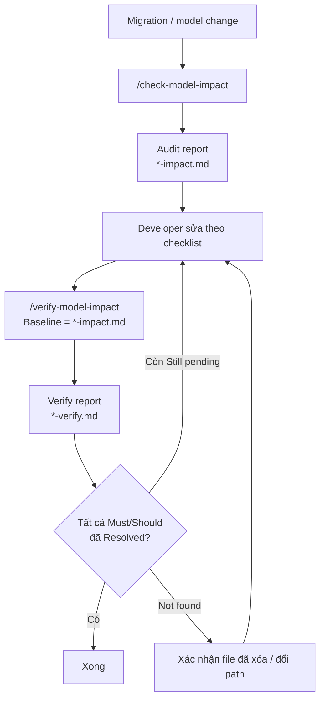

## Tóm tắt dễ hiểu về model impact workflow

Hai command cho Claude CLI/Cursor — dùng khi **thay đổi Model hoặc Migration** ảnh hưởng nhiều repo.

| Command | Mục đích |
|---------|----------|
| `/check-model-impact` | Tìm repo/file bị ảnh hưởng |
| `/verify-model-impact` | Kiểm tra đã sửa hết chưa (sau audit) |

---

### 1. Mục đích chính

Ví dụ thay đổi:

```text
Department.company_id → Department.branch_id
```

**Audit** trả lời:

> **"Thay đổi này ảnh hưởng repo/file nào và file nào cần sửa?"**

**Verify** trả lời:

> **"Tôi đã sửa hết các nơi bị ảnh hưởng chưa?"**

---

## 2. Hai command riêng

### `/check-model-impact` — audit

Input bắt buộc **chỉ**:

```text
Migration: ha-speaking-api/src/app/migrations/versions/xxx.py
```

Skill đọc file migration (`upgrade` / `downgrade`) rồi tự suy `Model` + tóm tắt thay đổi (table/column/index/FK). Không hỏi `Model` hay `Change summary`.

Output:

```text
Repo A
  ├── file1.py → Must update
  └── file2.py → Should verify

Repo B
  └── file3.ts → Maybe impacted
```

Report:

```text
.claude/reports/2026-08-13-branch-impact.md
```

---

### `/verify-model-impact` — kiểm tra sau khi sửa

Input bắt buộc **chỉ**:

```text
.claude/reports/2026-08-13-branch-impact.md
```

Cũng nhận `@...-impact.md` hoặc URL file. Không cần gõ `Baseline report:`. Skill tự trích `Model`, `Migration`, `Change summary` từ file đó.

Kết quả:

```text
Resolved       → đã xử lý
Still pending  → vẫn còn
Not found      → không tìm thấy reference
```

Report:

```text
.claude/reports/2026-08-13-branch-verify.md
```

---

## 3. Bắt buộc phải cung cấp

| Command | Required |
|---------|----------|
| `/check-model-impact` | `Migration` |
| `/verify-model-impact` | path / `@` / URL tới `*-impact.md` |
| `/update-model-impact-config` | path / `@` / URL tới `*-verify.md` (hoặc `full-scan`) |

Thiếu field bắt buộc → Claude **hỏi lại và dừng**. `/check-model-impact` tự suy Model + change summary từ file migration. `/verify-model-impact` tự suy baseline từ path/`@`/URL report — không bắt gõ nhãn `Baseline report`. `/update-model-impact-config` tự suy `Mode: reports` từ `*-verify.md` — không bắt gõ `Mode:` / `Reports:`.

---

## 4. Flow thực tế

```text
Migration thay đổi
       ↓
/check-model-impact
       ↓
Tìm repo + file bị ảnh hưởng
       ↓
Tạo checklist
       ↓
Developer sửa
       ↓
/verify-model-impact
       ↓
Xác nhận đã sửa hết chưa
```

Follow-up sau verify — còn `Still pending` thì sửa tiếp, chạy verify lại:



Chi tiết audit:

```text
/check-model-impact
        ↓
Đọc model-impact-audit/SKILL.md
        ↓
Đọc repos.md, repo-scan-profiles.md, impact-map.md
        ↓
Đọc migration
        ↓
Scan các repo liên quan
        ↓
Tạo *-impact.md
```

Chi tiết verify:

```text
/verify-model-impact
        ↓
Đọc model-impact-verify/SKILL.md
        ↓
Đọc baseline *-impact.md
        ↓
Re-scan file Must/Should
        ↓
Tạo *-verify.md
```

---

## 5. Skill, template, config — vị trí và mô tả

### Skills (logic chính)

| Skill | Đường dẫn | Mô tả |
|-------|-----------|-------|
| **model-impact-audit** | `.claude/skills/model-impact-audit/SKILL.md` | Quét cross-repo khi Model/Migration đổi ở `ha-speaking-api`. Đọc config + migration, scan từng repo theo layer, tạo checklist file cần sửa. |
| **model-impact-verify** | `.claude/skills/model-impact-verify/SKILL.md` | Re-scan sau khi dev sửa. Đọc baseline report, kiểm tra file Must/Should còn reference cũ không, báo Resolved / Still pending / Not found. |
| **model-impact-config-update** | `.claude/skills/model-impact-config-update/SKILL.md` | Refresh `.claude/config/` từ `*-verify.md` (và `*-impact.md` gắn kèm) hoặc `full-scan`. |

### Commands (entrypoint gọi skill)

| Command | Đường dẫn | Mô tả |
|---------|-----------|-------|
| `/check-model-impact` | `.claude/commands/check-model-impact.md` | Lệnh audit — chỉ cần path Migration; skill đọc file rồi suy Model + thay đổi schema. |
| `/verify-model-impact` | `.claude/commands/verify-model-impact.md` | Lệnh verify — đưa path/`@`/URL file `*-impact.md`; skill tự suy baseline rồi trích thông tin còn lại. |
| `/update-model-impact-config` | `.claude/commands/update-model-impact-config.md` | Lệnh refresh config — đưa path/`@`/URL file `*-verify.md`; skill tự suy reports mode và đọc luôn `*-impact.md` gắn trong verify. |

### Templates (format report output)

| Template | Đường dẫn | Mô tả |
|----------|-----------|-------|
| **impact-report** | `.claude/templates/impact-report.md` | Khung báo cáo audit: thay đổi nguồn, tóm tắt migration, rủi ro, findings theo repo/layer, checklist. |
| **impact-verify-report** | `.claude/templates/impact-verify-report.md` | Khung báo cáo verify: tóm tắt Resolved/Pending/Not found, trạng thái từng file, gợi ý sửa. |

### Config (skill đọc trước khi chạy)

| File | Đường dẫn | Mô tả |
|------|-----------|-------|
| **repos.md** | `.claude/config/repos.md` | Bản đồ repo sibling dưới `Haji/`: repo nào share DB, repo nào mirror schema, quan hệ giữa các repo. |
| **repo-scan-profiles.md** | `.claude/config/repo-scan-profiles.md` | Profile scan từng repo: layer nào cần kiểm tra (entity, repo, service, DTO, template, raw SQL…). |
| **impact-map.md** | `.claude/config/impact-map.md` | Map Model → thành phần liên quan: field/table nào, repo consumer nào thường bị ảnh hưởng. |

### Reports (output lưu sau khi chạy)

| Loại | Đường dẫn mẫu | Mô tả |
|------|---------------|-------|
| Audit | `.claude/reports/YYYY-MM-DD-<model>-impact.md` | Checklist file cần sửa sau `/check-model-impact`. |
| Verify | `.claude/reports/YYYY-MM-DD-<model>-verify.md` | Kết quả re-scan sau `/verify-model-impact`. |
| Tóm tắt | `.claude/reports/summary.md` | Tài liệu workflow này. |

Report đã có:

- `.claude/reports/2026-07-31-branch-impact.md`
- `.claude/reports/2026-08-12-situationword-impact.md`
- `.claude/reports/2026-08-13-situationlistening-impact.md`
- `.claude/reports/2026-08-13-situationlistening-verify.md`

### Cấu trúc thư mục `.claude/`

```text
.claude/
├── commands/                          # Entrypoint lệnh slash
│   ├── check-model-impact.md          # → gọi audit skill
│   └── verify-model-impact.md         # → gọi verify skill
├── skills/                            # Logic workflow
│   ├── model-impact-audit/SKILL.md    # Quét + tạo checklist
│   └── model-impact-verify/SKILL.md   # Re-scan + xác nhận đã sửa
├── templates/                         # Khung format report
│   ├── impact-report.md               # Audit output
│   └── impact-verify-report.md        # Verify output
├── config/                            # Cấu hình scan
│   ├── repos.md                       # Danh sách repo
│   ├── repo-scan-profiles.md          # Layer scan từng repo
│   └── impact-map.md                  # Model → thành phần liên quan
└── reports/                           # Báo cáo đã tạo
    ├── summary.md                     # Tài liệu tóm tắt
    └── *-impact.md / *-verify.md      # Report từng lần chạy
```

---

## 6. Mức độ ảnh hưởng

| Level | Ý nghĩa |
|-------|---------|
| `Must update` | Chắc chắn cần sửa |
| `Should verify` | Có khả năng ảnh hưởng, cần kiểm tra |
| `Maybe impacted` | Liên quan nhưng chưa chắc cần sửa |
| `Resolved` | Đã xử lý (verify) |
| `Still pending` | Vẫn chưa xử lý (verify) |
| `Not found` | Không tìm thấy reference (verify) |

---

## 7. Không sửa code

Cả hai command chỉ:

```text
READ → SCAN → ANALYZE → REPORT
```

Không `EDIT` / `DELETE` / `REFACTOR`. Developer tự sửa.

---

## 8. Ví dụ Branch

```text
/check-model-impact
Migration: ha-speaking-api/src/app/migrations/versions/xxx.py
```

Có thể phát hiện:

```text
ha-speaking-api       → Must update (Department, migration)
ha-speaking-admin-web → Must update (ORM, repo, service, UI)
ha-speaking-haij-student-api → Maybe impacted
```

Sau khi sửa:

```text
/verify-model-impact
.claude/reports/2026-07-31-branch-impact.md
```

---

**Mục tiêu:** giảm quên sync Model/Migration giữa `ha-speaking-api`, admin, company-web, student-api.
